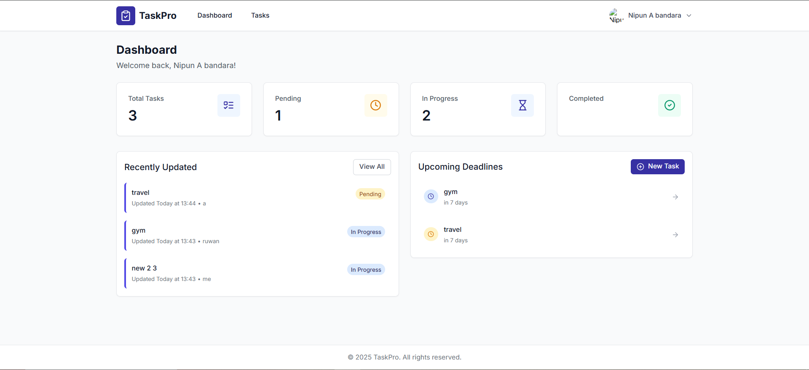

# ✅ Task Management WebApp

A full-stack **Task Management Web Application** built with modern technologies including **React**, **Node.js**, and **MongoDB**. Users can log in with Google, manage tasks, and export data as PDFs.

---

---
## ⚙️ Tech Stack

**Frontend:**
- React
- Tailwind CSS
- TypeScript

**Backend:**
- Node.js
- Express.js

**Database:**
- MongoDB

**Authentication:**
- OAuth 2.0 (Google)

**PDF Handling:**
- jsPDF (or similar libraries)

---

## ✨ Features

- 🔐 Google OAuth login
- 📋 Task creation, viewing, updating, and deletion
- 🔍 View task details
- 👤 User profile management
- 🧾 Export tasks as downloadable PDFs
- 🎨 Modern and responsive UI with Tailwind CSS
- 🛡️ Protected routes for authenticated users

---

## 🚀 Getting Started

### 1. Clone the repository

```bash
git clone https://github.com/your-username/task-management-app.git
cd task-management-app
```
---
## ✨ Backend

- https://github.com/nipunaloka/Task-Management-System-Backend.git
